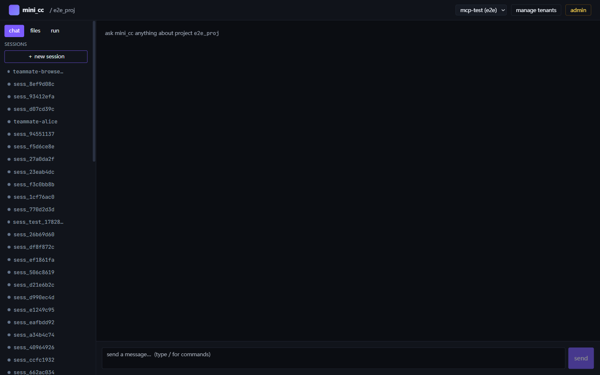

[English](./README.md) | 中文

# mini_cc — 多租户、可后端集成的 mini Claude Code

对 Claude Code harness 的多租户、沙箱化、可后端集成复刻：既可作为 Python
SDK 嵌入你的后端，也可作为 FastAPI HTTP/SSE 服务独立运行，并附带完整的
Web 控制台。

```
Agency 来自模型。mini_cc 给模型双手、双眼、工作区、队友和网络接口。
```



模型是司机，本项目是车辆。mini_cc 起源于对
[learn-claude-code](https://github.com/shareAI-lab/learn-claude-code)
所讲授的 19 子系统 harness 模式的生产化移植（其教学目录完整保留在
[`reference/`](./reference/learn-claude-code/) 供学习对照），并逐步成长为
完整平台：per-project 隔离、可插拔存储、无模块级全局状态、可选的
HTTP/SSE 传输层。

## 亮点

- **天然多租户** —— 每个子系统都 per-project 实例化，零模块级全局状态；
  per-tenant API key 支持权限 scope、有效期与轮换；跨租户访问一律 404，
  不泄露资源是否存在。
- **Agent 内核** —— 流式 `AgentLoop`、分层上下文压缩（含 transcript 快照）、
  重试 / token 升级 / 模型降级恢复链、hooks、交互式权限审批、子代理、
  按需技能加载。
- **团队编排** —— JSONL 消息总线邮箱、计划审批协议、队友生成器（空闲轮询
  认领任务）、per-task git worktree、LeadWatcher 自主唤醒。
- **IM 渠道** —— 双向渠道抽象，把会话绑定到外部 IM；内置飞书 webhook
  收发。
- **两层沙箱** —— 宿主机 `SubprocessSandbox`（路径校验 + 命令策略 +
  环境变量过滤），叠加可选的 per-tenant Docker 容器层；Docker 不可用时
  自动降级。
- **可观测性** —— Prometheus `/metrics`、per-tenant token 归因、可选
  OpenTelemetry tracing、贯穿全链路的 `X-Trace-Id` 关联。
- **Web 控制台** —— Vite + React 19 + TypeScript 深色 UI：SSE 流式聊天
  与可折叠活动卡片、内联权限审批、文件树（上传 / 预览 / ZIP 下载）、
  会话冷/热管理、admin 密钥与指标面板、团队时间线、渠道管理面板；
  附 Playwright e2e 测试。
- **测试充分** —— 150+ 个 pytest 文件，覆盖鉴权、隔离、SSE、沙箱、团队、
  渠道、cron、MCP、插件与 workflow。

## 快速开始

```bash
pip install -r requirements.txt

# 签发租户密钥
python -m mini_cc.server keygen my_tenant        # → mck_<32hex>

# 启动服务（默认 127.0.0.1:8000）
python -m mini_cc.server
```

任意语言通过 HTTP/SSE 对话：

```bash
curl -X POST http://localhost:8000/tenants/my_tenant/projects \
     -H "Authorization: Bearer mck_<key>" \
     -H "Content-Type: application/json" \
     -d '{"project_id":"demo"}'

curl -N -X POST \
     http://localhost:8000/tenants/my_tenant/projects/demo/sessions/s1/send \
     -H "Authorization: Bearer mck_<key>" \
     -H "Content-Type: application/json" \
     -d '{"user_input":"hello"}'
```

或作为 SDK 进程内嵌入：

```python
from mini_cc import ProjectManager, SessionManager

pm = ProjectManager("./mini_cc_data")
pm.create(tenant_id="t1", project_id="demo")
sm = SessionManager(pm)
sess = sm.start_session("demo")
for ev in sm.send("demo", sess.session_id, "list the files here"):
    print(ev["type"])
```

### Web 控制台

```bash
cd mini_cc/web
npm install && npm run dev        # http://localhost:5173
```

用 `keygen` 输出的 `mck_<hex>` 密钥登录。通过 `ANTHROPIC_BASE_URL` /
`ANTHROPIC_API_KEY` / `MODEL_ID` 指向 Anthropic 或任意 Anthropic 兼容代理
（如 LiteLLM）。

## 架构

```
┌─────────────────────────────────────────────────────────────────┐
│  web/      React 控制台（chat、files、sessions、admin、team）     │
├─────────────────────────────────────────────────────────────────┤
│  server/   FastAPI、HTTP/SSE、API-key 鉴权、scope、metrics      │  ← 传输层
├─────────────────────────────────────────────────────────────────┤
│  session/  SessionManager（项目级锁、断点恢复）                   │  ← 编排层
│  projects/ ProjectManager（租户元数据、目录布局）                 │
├─────────────────────────────────────────────────────────────────┤
│  core/     AgentLoop、hooks、recovery、压缩、subagent           │  ← Agent 内核
│  teams/    MessageBus、ProtocolTracker、TeammateSpawner         │
│  channels/ IM 渠道绑定（飞书）                                    │
│  tools/    bash、fs、todo、cron、task、worktree、mcp、...        │
│  skills/   按需技能加载        mcp/  MCP 客户端/连接池            │
│  scheduler/ CronScheduler    workflow/ 审批流                    │
├─────────────────────────────────────────────────────────────────┤
│  sandbox/  SubprocessSandbox + Docker 容器层 + Policy           │  ← 隔离层
│  storage/  可插拔 Storage 接口，默认 FSStorage                   │
│  auth/     TenantKeyRegistry（与传输层无关）                     │
└─────────────────────────────────────────────────────────────────┘
```

每层只依赖更下层。SDK 内核对 HTTP 传输一无所知。完整模块关系图见
[`mini_cc/ARCH.zh.md`](./mini_cc/ARCH.zh.md)。

## 目录结构

| 路径                                  | 说明                                          |
| ------------------------------------- | --------------------------------------------- |
| [`mini_cc/`](./mini_cc/README.md)     | 框架本体：SDK、server、tools、web 控制台       |
| [`tests/`](./tests/)                  | pytest 测试集（150+ 文件）                    |
| [`docs/mini_cc/`](./docs/mini_cc/)    | 14 章双语内核机制深度解析                      |
| [`docs/plans/`](./docs/plans/)        | 各阶段设计文档（鉴权、沙箱、团队、渠道 ...）    |
| [`reference/learn-claude-code/`](./reference/learn-claude-code/README.md) | 上游教学目录，留作学习参考 |

## 文档

- [`mini_cc/README.md`](./mini_cc/README.md) —— 框架完整参考：API 面、
  HTTP 端点、安全模型、配置项、沙箱、测试、Web UI。
- [`docs/mini_cc/`](./docs/mini_cc/README.md) —— 《进阶内部原理》：14 章
  逐模块双语深度解析，每章含 file:line 引用与可运行的验证步骤。
- [`mini_cc/DEPLOYMENT.md`](./mini_cc/DEPLOYMENT.md) —— 部署说明。

## 致谢

本项目衍生自
[shareAI-lab/learn-claude-code](https://github.com/shareAI-lab/learn-claude-code)
—— 一门出色的 harness 工程课程，用 20 个渐进式教学目录讲透如何从零构建
Claude Code 风格的 agent。上游教学目录完整保留在
[`reference/learn-claude-code/`](./reference/learn-claude-code/README.md)，
读者可以追溯 mini_cc 各项模式的出处；mini_cc 本身则是对这些思想面向生产
环境的全新多租户重构。

向上游作者与贡献者致以诚挚感谢。

## 许可证

[MIT](./LICENSE)
