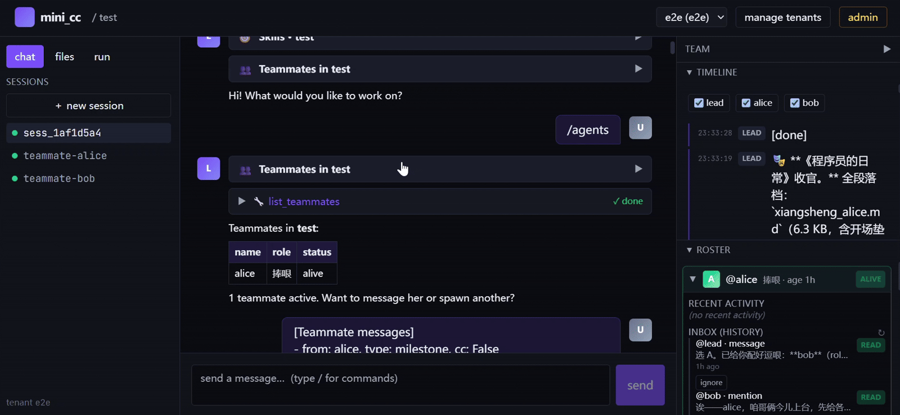

[English](./README.md) | 中文

[](https://github.com/PengyiZhang/mini-claude-code/actions/workflows/ci.yml)

# mini_cc — 多租户、可后端集成的 mini Claude Code

对 Claude Code harness 的多租户、沙箱化、可后端集成复刻：既可作为 Python
SDK 嵌入你的后端，也可作为 FastAPI HTTP/SSE 服务独立运行，并附带完整的
Web 控制台——内置多 agent 团队协作、审批工作流与双向 IM 渠道。



```
Agency 来自模型。mini_cc 给模型双手、双眼、工作区、队友和网络接口。
```


模型是司机，本项目是车辆。mini_cc 起源于对
[learn-claude-code](https://github.com/shareAI-lab/learn-claude-code)
所讲授的 19 子系统 harness 模式的生产化移植（其教学目录完整保留在
[`reference/`](./reference/learn-claude-code/) 供学习对照），并逐步成长为
完整平台：per-project 隔离、可插拔存储、无模块级全局状态、可选的
HTTP/SSE 传输层。

## 功能特性

### 多租户平台

- 每个子系统都 per-project 实例化，**零模块级全局状态**
- per-tenant API key 支持**权限 scope、有效期与轮换**（含宽限期旧 key
  并存）；跨租户访问一律 404，不泄露资源是否存在
- per-tenant 令牌桶限流、Prometheus `/metrics` 与 token 归因、可选
  OpenTelemetry tracing、`X-Trace-Id` 全链路关联
- **项目模板**创建（空白 / Python CLI / Skill 起步包）
- 签名只读**分享链接**（`sh_...` HMAC token，带 TTL），可嵌入的会话
  记录页面；出站 **webhook**（HMAC 签名、SSRF 防护）

### Agent 内核

- 流式 `AgentLoop`；分层上下文**压缩**（含 transcript 快照）；重试 /
  token 升级 / 模型降级**恢复链**
- **Hooks** 与可选**交互式权限审批**（`permissions.toml` 把指定工具变成
  SSE 权限弹窗，支持批准/拒绝/超时）
- 子代理、按需**技能加载**（SKILL.md 技能包）、三层声明式**记忆**
  （system → tenant → project，关键词召回，写入走工具门控）
- per-project **MCP** 连接池（`/mcp connect|tools|reconnect`）
- **LSP 工具**：按需启动语言服务器（pyright、clangd、TS、rust-analyzer、
  gopls...），暴露跳转定义 / 引用 / 调用层次
- per-project **cron** 调度 + 秒级一次性**唤醒**（agent 自我调度节奏）；
  后台任务卸载与实时状态

### 多 agent 团队（teammates）

- `/agents spawn <name> <role> --prompt ...` 生成具名队友——每个都是独立
  线程里的完整子 AgentLoop；支持 stop / edit / delete
- **JSONL 消息总线**：per-teammate 邮箱 + 追加式历史、带共享 id 的广播、
  result/milestone/blocker 自动抄送 lead
- **计划审批门**：`submit_plan` → `review_plan` 握手会阻塞队友的下一轮
- **自主执行**：空闲轮询自动认领未认领任务（尊重 `blockedBy` 依赖、自动
  cd 进任务的 git worktree）；做完自动挂起；支持定时自我唤醒
- **`@提及` 路由**（支持中文名）直达队友邮箱；收件箱已读/未读/忽略管理
- **LeadWatcher** 守护线程：你不在时队友的结果一到就唤醒 lead

### 工作流（workflow）

- **动态工作流（V1）**：dict 或 markdown 定义的提示词步骤链；每步支持
  条件、并行、重试/跳过/中止策略、`{step_id}` 结果替换；`/workflow
  save|load|list` 持久化
- **Workflow V2**：版本化定义 + 类型化步骤——`action`、`validate`、
  `checkpoint`（人工审批）、`webhook_wait`、`email_wait`；软条件分支与
  显式 `next` 跳转/回环；触发器：manual / webhook / schedule / email
- **审批门**暂停执行流并列出候选审批人（存活队友 → 停止队友 → lead →
  自由填写）；可通过 UI 按钮、入站 webhook 载荷或入站邮件解除
- 三栏式**工作流控制台**（定义/运行、带批准/拒绝按钮的事件时间线、步骤
  检视器）+ 每会话的**运行面板**（活跃工作流与后台任务）

### IM 渠道

- **双向渠道抽象**：把会话绑定到外部 IM——入站聊天变成 agent 轮次，
  agent/队友事件推送出去；按渠道过滤事件类型；密钥读取时脱敏
- **内置飞书**：URL 验证握手、签名校验、AES 加密信封解密、出站走缓存
  `tenant_access_token`；新渠道类型用 `register_channel_kind` 注册

### 沙箱与隔离

- 宿主机 `SubprocessSandbox`：路径白名单、命令策略、环境变量过滤
- 可选 per-tenant **Docker 容器层**（工作区 bind-mount、声明式
  apt/pip/node 包、CPU/内存限制、额外挂载），Docker 不可用时**自动降级**
  到 subprocess

### Web 控制台与命令

- Vite + React 19 + TypeScript 深色 UI：SSE 流式聊天与可折叠活动卡片、
  内联权限审批、文件树（上传 / 文件夹上传 / 预览 / ZIP 下载）、会话
  冷/热管理、团队时间线与队友面板、todo 面板、渠道面板、admin 密钥与
  指标看板；聊天内 **Mermaid 图渲染**；附 Playwright e2e 测试
- **20+ 服务端斜杠命令**（`/agents`、`/workflow`、`/channels`、
  `/sessions`、`/cost`、`/model`、`/permissions`、`/loop`、`/bg`、
  `/skills`、`/mcp`、`/tasks`、`/config`、`/search`、`/fork`、
  `/export` ...）产出类型化**卡片事件**（列表/表格/键值/步骤），带操作
  按钮与实时自动刷新

### 测试充分

150+ 个 pytest 文件，覆盖鉴权、租户隔离、SSE、沙箱、团队、渠道、cron、
MCP、插件、工作流与分享 token。

## 快速开始

```bash
pip install -r requirements.txt

# 签发租户密钥
python -m mini_cc.server keygen my_tenant        # → mck_<32hex>

# 启动服务（默认 127.0.0.1:8000）
python -m mini_cc.server
```

任意语言通过 HTTP/SSE 对话：

```bash
curl -X POST http://localhost:8000/tenants/my_tenant/projects \
     -H "Authorization: Bearer mck_<key>" \
     -H "Content-Type: application/json" \
     -d '{"project_id":"demo"}'

curl -N -X POST \
     http://localhost:8000/tenants/my_tenant/projects/demo/sessions/s1/send \
     -H "Authorization: Bearer mck_<key>" \
     -H "Content-Type: application/json" \
     -d '{"user_input":"hello"}'
```

或作为 SDK 进程内嵌入：

```python
from mini_cc import ProjectManager, SessionManager

pm = ProjectManager("./mini_cc_data")
pm.create(tenant_id="t1", project_id="demo")
sm = SessionManager(pm)
sess = sm.start_session("demo")
for ev in sm.send("demo", sess.session_id, "list the files here"):
    print(ev["type"])
```

### Web 控制台

```bash
cd mini_cc/web
npm install && npm run dev        # http://localhost:5173
```

用 `keygen` 输出的 `mck_<hex>` 密钥登录。通过 `ANTHROPIC_BASE_URL` /
`ANTHROPIC_API_KEY` / `MODEL_ID` 指向 Anthropic 或任意 Anthropic 兼容代理
（如 LiteLLM）。

## 架构

```
┌─────────────────────────────────────────────────────────────────┐
│  web/       React 控制台（chat、files、run、channels、team、     │
│             workflow、admin、todo）                              │
├─────────────────────────────────────────────────────────────────┤
│  server/    FastAPI、HTTP/SSE、API-key 鉴权、scope、metrics     │  ← 传输层
│  channels/  双向 IM 绑定（飞书）                                  │
│  sharing/   签名分享链接、出站 webhook                           │
├─────────────────────────────────────────────────────────────────┤
│  session/   SessionManager（项目级锁、断点恢复）                  │  ← 编排层
│  projects/  ProjectManager（租户元数据、模板）                    │
├─────────────────────────────────────────────────────────────────┤
│  core/      AgentLoop、hooks、recovery、压缩、subagent          │  ← Agent 内核
│  teams/     MessageBus、ProtocolTracker、TeammateSpawner、      │
│             LeadWatcher、@提及路由                                │
│  workflow/  V1 动态运行器 + V2 审批运行                           │
│  tools/     bash、fs、todo、cron、task、worktree、mcp、lsp、...  │
│  skills/    按需技能加载       memory/  三层记忆                  │
│  mcp/       MCP 客户端/池      plugins/ 三层插件                 │
│  scheduler/ Cron + 唤醒        commands/ 卡片与命令              │
├─────────────────────────────────────────────────────────────────┤
│  sandbox/   SubprocessSandbox + Docker 容器层 + Policy          │  ← 隔离层
│  storage/   可插拔 Storage 接口，默认 FSStorage                   │
│  auth/      TenantKeyRegistry（与传输层无关）                     │
└─────────────────────────────────────────────────────────────────┘
```

每层只依赖更下层。SDK 内核对 HTTP 传输一无所知。完整模块关系图见
[`mini_cc/ARCH.zh.md`](./mini_cc/ARCH.zh.md)。

## 目录结构

| 路径                                  | 说明                                          |
| ------------------------------------- | --------------------------------------------- |
| [`mini_cc/`](./mini_cc/README.md)     | 框架本体：SDK、server、tools、web 控制台       |
| [`tests/`](./tests/)                  | pytest 测试集（150+ 文件）                    |
| [`docs/mini_cc/`](./docs/mini_cc/)    | 15 章双语内核机制深度解析                      |
| [`docs/plans/`](./docs/plans/)        | 各阶段设计文档（鉴权、沙箱、团队、渠道 ...）    |
| [`reference/learn-claude-code/`](./reference/learn-claude-code/README.md) | 上游教学目录，留作学习参考 |

## 文档

- [`mini_cc/README.md`](./mini_cc/README.md) —— 框架完整参考：API 面、
  HTTP 端点、安全模型、配置项、沙箱、测试、Web UI。
- [`docs/mini_cc/`](./docs/mini_cc/README.md) —— 《进阶内部原理》：逐模块
  双语深度解析，每章含 file:line 引用与可运行的验证步骤。
- [`mini_cc/DEPLOYMENT.md`](./mini_cc/DEPLOYMENT.md) —— 部署说明。

## 致谢

本项目衍生自
[shareAI-lab/learn-claude-code](https://github.com/shareAI-lab/learn-claude-code)
—— 一门出色的 harness 工程课程，用 20 个渐进式教学目录讲透如何从零构建
Claude Code 风格的 agent。上游教学目录完整保留在
[`reference/learn-claude-code/`](./reference/learn-claude-code/README.md)，
读者可以追溯 mini_cc 各项模式的出处；mini_cc 本身则是对这些思想面向生产
环境的全新多租户重构。

向上游作者与贡献者致以诚挚感谢。

## 许可证

[MIT](./LICENSE)
