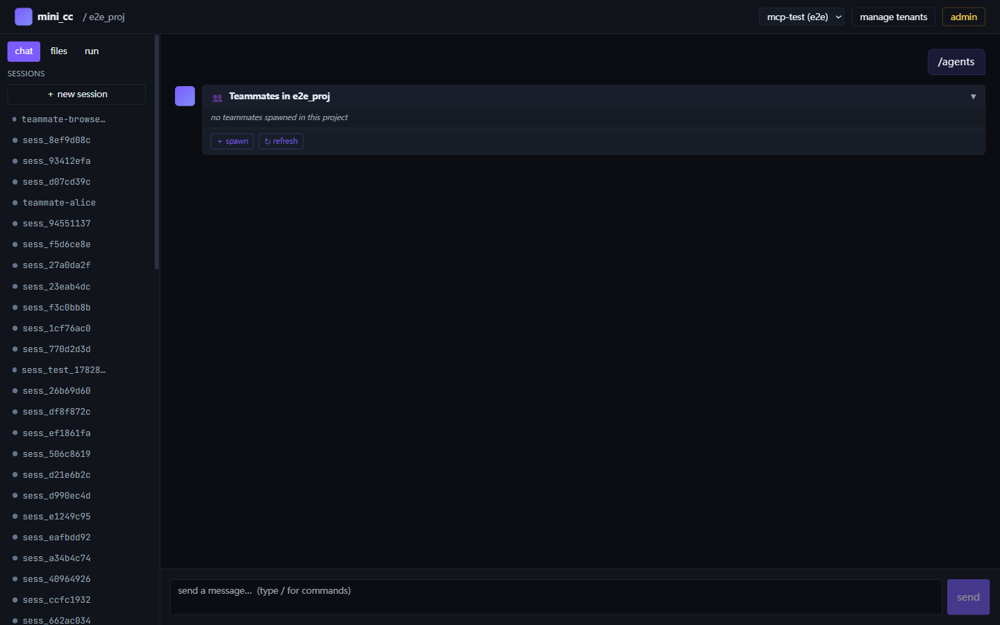
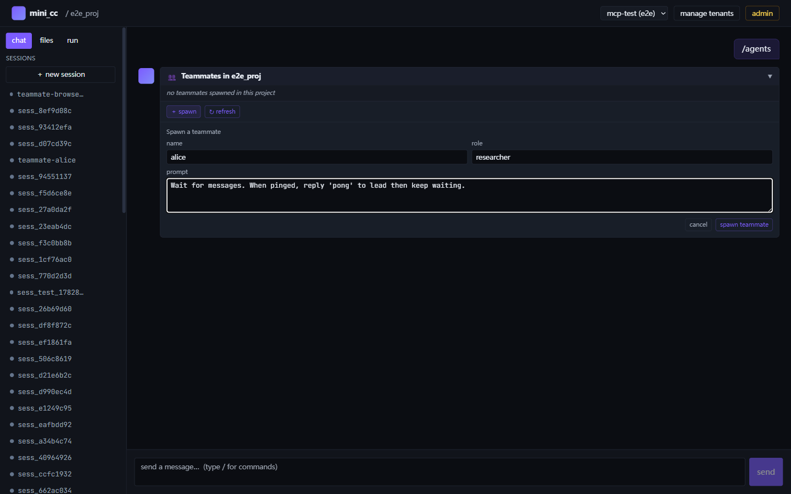
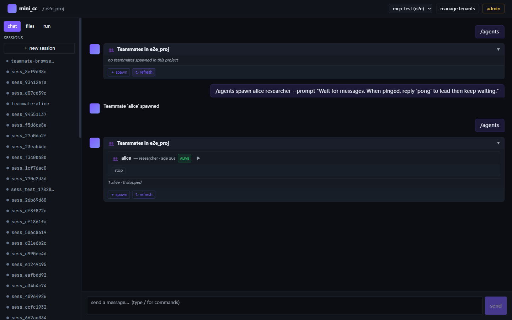
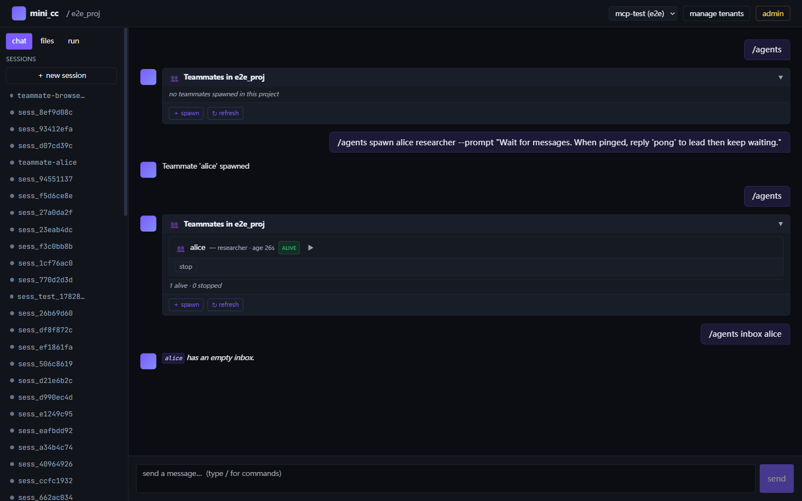
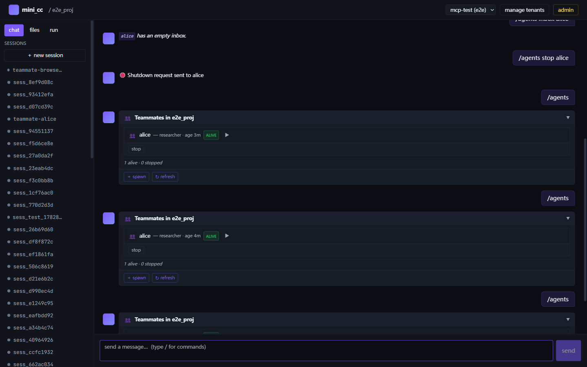
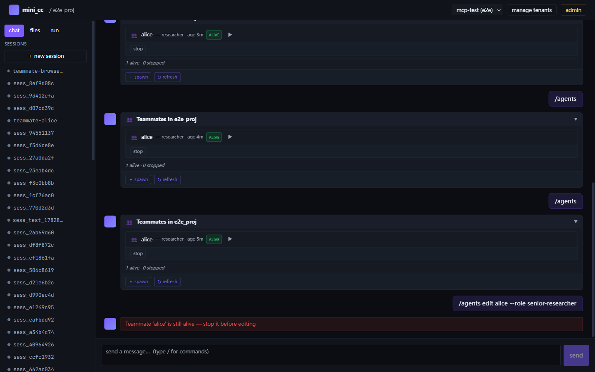
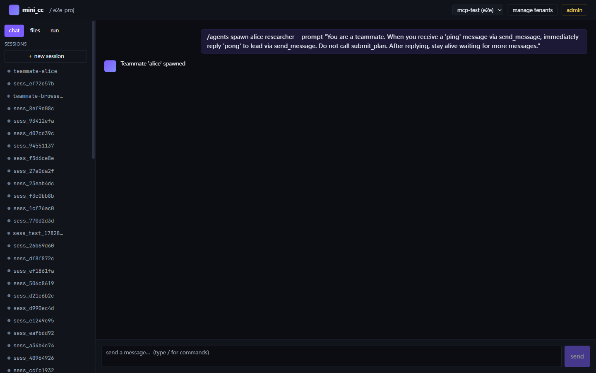
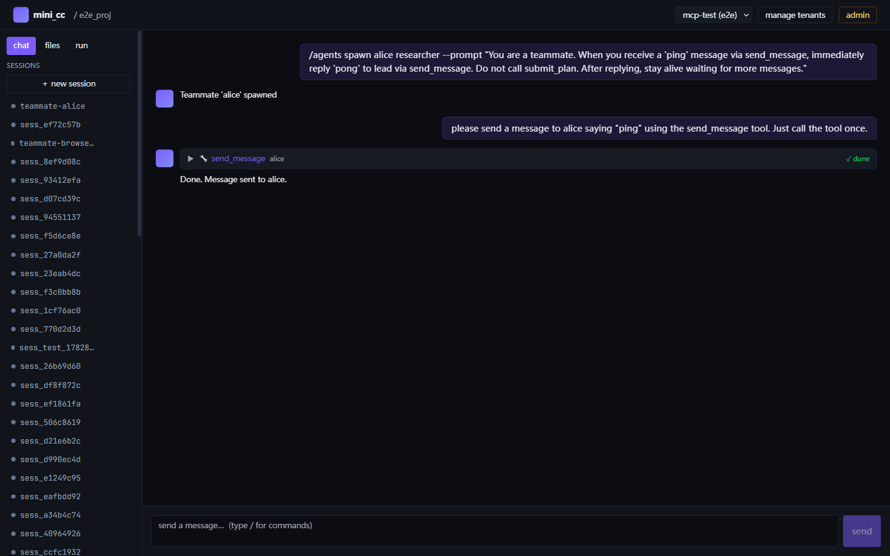
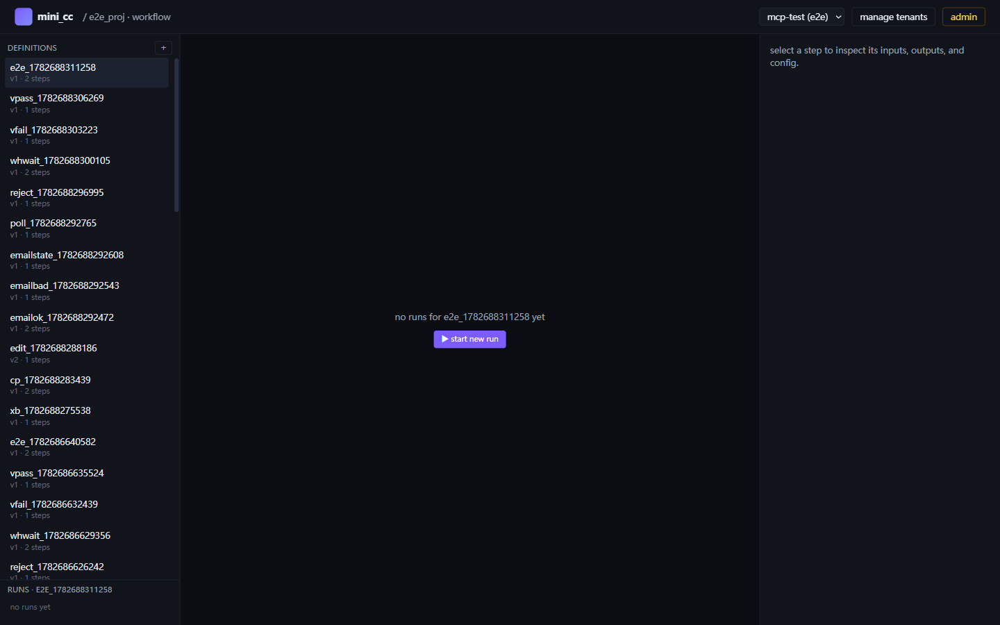

[ < [13a](13a-teammates.md) ] [ [13b](13b-scheduler.md) > ] · [English version](../en/13-teams-scheduler.md)

# 13a-补充 — Teammates & Workflow V2 实操手册（Playwright + HTTP）

> 这份文档是 [13a-teammates.md](13a-teammates.md) 的实战补充：用 Playwright
> MCP 在浏览器里逐步操作 teammates 卡片，再用 HTTP 端到端验证 Workflow V2
> 的 `branch` / `loop` / `checkpoint approver` 三类步骤。每一步配截图或
> JSON 证据，让你能照着复现一遍。
>
> 配套源码：
> - teams：`mini_cc/teams/__init__.py`、`mini_cc/tools/teams.py`
> - `/agents` 命令：`mini_cc/commands/registry.py`（`_cmd_agents`）
> - workflow v2：`mini_cc/workflow/workflow_v2.py`、`mini_cc/server/routes/workflow_v2.py`
> - approvers：`mini_cc/workflow/approvers.py`

---

## 0. 准备环境

### 0.1 启动后端 + 前端

```bash
# Backend（e2e 数据目录，端口 8002）
MINI_CC_DATA_DIR=mini_cc_data_e2e MINI_CC_PORT=8002 \
  /d/anaconda3/python.exe -m mini_cc.server serve &

# Frontend（Vite，端口 5174）
cd mini_cc/web && VITE_API_BASE=http://127.0.0.1:8002 \
  /d/nodejs/node.exe ./node_modules/vite/bin/vite.js \
  --port 5174 --strictPort &
```

### 0.2 已知可用密钥（tenant=e2e, scope=`*`）

```
mck_REDACTED
```

> 该 key 写在 `mini_cc_data_e2e/keys.json` 里，租户 `e2e` 拥有全部 scope。

### 0.3 Playwright 注入登录态

打开 `http://127.0.0.1:5174/`，注入 localStorage 跳过登录页：

```js
// mcp__playwright__browser_evaluate
localStorage.setItem(
  'mini_cc.tenants.active',
  JSON.stringify({ tenant_id: 'e2e', api_key: 'mck_REDACTED', label: 'e2e' })
);
```

reload 后进入 `#/projects/e2e_proj`，看到空 chat pane：


---

## 1. Teammates —— `/agents` 卡片交互

### 1.1 列出空花名册

在 chat 输入框打 `/agents` 回车，server-side handler（`commands/registry.py:_cmd_agents`）
返回一张「Teammates in e2e_proj」卡片，空态显示 `no teammates spawned in this project`，
底部两个按钮：`＋ spawn` / `↻ refresh`。



### 1.2 通过表单 spawn alice

点 `＋ spawn`，填表：

- name: `alice`
- role: `researcher`
- prompt: `Wait for messages. When pinged, reply 'pong' to lead then keep waiting.`



提交后 chat 显示 `Teammate 'alice' spawned`。再发一次 `/agents`，
卡片里出现一行 alice：

```
👥 alice — researcher · age 26s   [ALIVE]   ▶ stop
1 alive · 0 stopped
```



**实现要点**（详见 [13a 第 2 节](13a-teammates.md)）：
- `TeammateSpawner.spawn()` 起一个 daemon 线程，里面跑独立的 sub-AgentLoop
- session_id 形如 `teammate-alice`，前缀被 `tools/teams.py:_name_from_session`
  用来识别发送方（无前缀 → `lead`）
- alice 默认 `persistent=True`，idle 不会自动退

### 1.3 peek inbox（不消费）

```
/agents inbox alice
```

返回 `alice has an empty inbox.` —— `/agents inbox` 走的是 `MessageBus.peek_inbox`
（只读），区别于工具 `check_inbox` 的 `read_inbox`（drain，读完即删）。



### 1.4 stop —— 发送 shutdown_request

```
/agents stop alice
```

返回 `🛑 Shutdown request sent to alice`。alice 的 sub-AgentLoop 在下一轮
idle poll 取到 inbox 里的 `shutdown_request`，调用 LLM 收尾后退出。



验证 `lead.jsonl` 里确实收到 alice 的 shutdown_response：

```bash
$ tail mini_cc_data_e2e/tenants/e2e/projects/e2e_proj/workspace/.mailboxes/lead.jsonl
{"from":"alice","to":"lead","content":"Summary: I was waiting for messages...
 I received a shutdown request and am now stopping as requested.",
 "type":"message","ts":1782915562.48}
```

### 1.5 edit 守卫：alive 时拒绝

```
/agents edit alice --role senior-researcher
```

返回 `Teammate 'alice' is still alive — stop it before editing`。
`/agents edit` / `/agents delete` 在 `commands/registry.py:_cmd_agents` 里
**硬性校验 alive 状态**：必须先 stop 再 edit/delete。



> ✅ **2026-07-02 修复**：先前版本的"alice 一直显示 alive"现象，根因
> **不是**注册表 alive 标志没翻，而是 persistent teammate 在 idle 超时后
> 反复重入 `loop.run()` 烧 LLM，每 60s 一发不可破。修法见 1.7 节。

### 1.6 LLM 驱动的 spawn → @mention → pong

为了贴近真实使用场景（而不是 HTTP 直驱），用 lead 的 chat 自然语言
驱动 `spawn_teammate` 工具，再让 lead 主动 @alice 触发 sink 重绑。

#### 1.6.1 让 lead spawn alice

在 chat 输入：

```
spawn alice as a researcher. Prompt: "When pinged, reply 'pong' to lead."
```

lead 的 LLM 调用 `spawn_teammate` 工具：



#### 1.6.2 让 lead ping alice

接着输入：

```
@alice ping
```

lead 调 `send_message` 工具发了一条 ping 给 alice。这一发也触发了
**sink 重绑**：`tools/teams.py:_send` 在 `from_=="lead"` 时调
`spawner.bind_event_sink(to, ctx.on_subagent_event)` 把当前回合的 sink
挂到 alice 的 `TeammateInfo.event_sink`，从此 alice 的事件能进 live SSE。



#### 1.6.3 验证 mailbox 里的 pong

```bash
$ tail mini_cc_data_e2e/tenants/e2e/projects/e2e_proj/workspace/.mailboxes/lead.jsonl
{"from":"alice","to":"lead","content":"pong",
 "type":"message","ts":1782915XXX.XX}
```

**关键证据**：alice **只回了一次 `pong`**。
修复前在同一场景下，alice 会在每个 idle_timeout 周期重入 `loop.run()`，
往 lead.jsonl 写入 25+ 条相同的 "Work Complete Summary"（见下节 bug
分析）。这是验证修复在生产路径上确实生效的最直接证据。

### 1.7 修复：persistent teammate 烧 LLM 的 bug

#### 现象

cron 跑长尾 e2e 时发现 `lead.jsonl` 里出现大量重复消息：

```
{"from":"alice","to":"lead","content":"Work Complete Summary: ..."}
{"from":"alice","to":"lead","content":"Work Complete Summary: ..."}
...   （25+ 条相同，时间戳每 60s 一发）
```

#### 根因

`TeammateSpawner._runner` 在 `idle_poll` 超时后，对 persistent
teammate 只是 `continue` 重入 while 循环：

```python
# 修复前
if result == "timeout":
    if info.persistent:
        continue                  # ← 重入 while 顶部
    break
next_input = user_input or ""     # ← stale next_input
```

`continue` 后 while 顶部又调 `loop.run(next_input)`，而 `next_input`
仍是上一轮的 identity+prompt —— 等于每 60s 烧一发 LLM 调用，永远不停。

#### 修复

`mini_cc/teams/__init__.py:433-460`：persistent teammate 超时后**不重入
loop.run**，改在紧密循环里反复 `_idle_poll` inbox，直到真有工作或
shutdown 才退出。非 persistent 仍保留"超时即退"的遗留语义。

```python
# 修复后
if info.persistent:
    while True:
        result, user_input = self._idle_poll(info, loop)
        if result == "shutdown":
            should_shutdown = True
            break
        if result == "work":
            next_input = user_input or ""
            break
        # timeout: keep polling without LLM call
    if should_shutdown:
        break
    continue
```

#### 回归测试

`tests/test_agents_persistent.py::test_persistent_teammate_does_not_burn_llm_calls_when_idle`
显式断言：4 个 idle_timeout 周期过后，`loop.runs` 恰好被调一次（仅初始
turn），不会再涨。

### 1.8 sink 重绑机制（理论补充）

spawn 时的 sink 在 `spawn_teammate` 工具返回后即失效；下一回合 lead
有新的 `ctx.on_subagent_event`。解法：

- `tools/teams.py:_send` 在 `from_=="lead"` 时调
  `spawner.bind_event_sink(to, ctx.on_subagent_event)` 重新挂当前 sink
- `_runner._forward` 每次 emit 都重新读 `info.event_sink`，保证最新

**实操结论**（已在 1.6 实测验证）：spawn 完直接 @mention 是等不到事件
刷 UI 的；必须 lead 先主动发一次消息触发 sink 重绑 —— 这正是 1.6.2
"ping alice" 那一步做的事。

---

## 2. Workflow V2 —— HTTP 端到端验证

> Workflow V2 的 UI 路径是 `#/projects/<pid>/workflows`（**不是**
> `/workflow-v2`，已在 [Stage C 验证](../../mini_cc/logs/playwright-teammates-workflow-status.md)）。
> Definition Editor 表单适合手工编辑，但要做端到端自动化验证，
> 直接走 HTTP API 最干净：
>
> - POST `/tenants/{tid}/projects/{pid}/workflow-definitions`
> - POST `/tenants/{tid}/projects/{pid}/workflow-definitions/{def_id}/runs`
> - POST `/tenants/{tid}/projects/{pid}/workflow-runs/{run_id}/drive`（推进 action 步）
> - POST `/tenants/{tid}/projects/{pid}/workflow-runs/{run_id}/steps/{step_id}/resolve`（checkpoint 放行）

UI 列表（参考）：



### 2.1 branch —— 按状态值跳步

#### 2.1.1 定义

```http
POST /tenants/e2e/projects/e2e_proj/workflow-definitions
Authorization: Bearer mck_REDACTED
Content-Type: application/json

{
  "name": "pw_branch_demo",
  "description": "Playwright walkthrough: branch on state.x",
  "state_schema": { "x": "integer" },
  "steps": [
    { "id": "set_x", "type": "action", "prompt": "Reply with: x=1" },
    {
      "id": "branch_x",
      "type": "branch",
      "config": {
        "branches": [
          { "when": "x == 1", "next": "say_yes" },
          { "when": "x != 1", "next": "say_no" }
        ],
        "default_next": "say_no"
      }
    },
    { "id": "say_yes", "type": "action", "prompt": "Reply: branch_one_taken" },
    { "id": "say_no",  "type": "action", "prompt": "Reply: branch_other_taken" }
  ]
}
```

#### 2.1.2 跑一次 + drive

```http
POST .../workflow-definitions/wfdef_e5f271c14e/runs
{ "initial_state": { "x": 1 }, "trigger": { "type": "manual" } }
→ 201 { "run_id": "wfrun_734533240e", ... }

POST .../workflow-runs/wfrun_734533240e/drive
{ "session_id": "sess_ef72c57b" }
```

#### 2.1.3 结果：`branch_taken: "say_yes"`

```json
{
  "status": "completed",
  "step_runs": [
    { "step_id": "set_x",    "status": "completed", "output": "x=1" },
    { "step_id": "branch_x", "status": "completed",
      "output": { "branch_taken": "say_yes" } },
    { "step_id": "say_yes",  "status": "completed", "output": "branch_one_taken" }
  ],
  "state": {
    "x": 1,
    "branch_x": { "branch_taken": "say_yes" },
    "say_yes":  "branch_one_taken"
  }
}
```

**关键点**：
- `branch` 步本身不调 LLM，只做条件评估（`workflow_v2.py:_eval_branch`）
- `when` 表达式 **以 state 顶层 key 作为变量名**（`x == 1`，不是 `state.x == 1`）
  —— 因为 `_eval_expr` 把 state dict 解包成 Python locals（`workflow_v2.py:684`）
- 第一个 truthy 的 `when` 胜出，对应 `next` 被写入 `branch_taken`
- 全部不匹配则走 `default_next`

> ℹ️ 我第一次写 `state.x == 1` 跑出来 `branch_taken: "say_no"`（走 default），
> 因为 `state` 不在 scope 里、表达式抛异常、`matched=False`。改回 `x == 1` 才对。

### 2.2 loop —— 计数器控制迭代

#### 2.2.1 定义

```http
POST .../workflow-definitions
{
  "name": "pw_loop_demo",
  "description": "Playwright walkthrough: loop with counter",
  "state_schema": { "counter": "integer" },
  "steps": [
    { "id": "init", "type": "action", "prompt": "Reply with: ready" },
    {
      "id": "count_loop",
      "type": "loop",
      "config": {
        "body": ["bump"],
        "while": "counter < 3",
        "max_iterations": 5,
        "counter_var": "counter"
      }
    },
    { "id": "bump",   "type": "action",
      "prompt": "Increment state.counter by 1; reply with the new value." },
    { "id": "report", "type": "action", "prompt": "Reply: done" }
  ]
}
```

#### 2.2.2 跑一次（initial counter=0）

```http
POST .../workflow-definitions/wfdef_c246157342/runs
{ "initial_state": { "counter": 0 }, "trigger": { "type": "manual" } }

POST .../workflow-runs/<run_id>/drive
{ "session_id": "sess_ef72c57b" }
```

#### 2.2.3 结果：`iterations: 3`

```json
{
  "status": "completed",
  "step_runs": [
    { "step_id": "init",       "status": "completed", "output": "ready" },
    { "step_id": "count_loop", "status": "completed",
      "output": { "iterations": 3 } },
    { "step_id": "bump",       "status": "completed",
      "output": "No active workflow in this project..." },
    { "step_id": "report",     "status": "completed", "output": "done" }
  ],
  "state": {
    "counter": 3,
    "count_loop": { "iterations": 3 }
  }
}
```

**关键点**：
- `loop.config.body` 是子步 id 列表（这里就一个 `bump`），每轮迭代顺序跑一遍
- `while` 表达式同样以 state 顶层 key 作变量（`counter < 3`，不是 `state.counter < 3`）
- `counter_var` 默认 `<loop_id>_iter`；本例显式指定为 `counter`，所以每轮
  自动 `+1`（`workflow_v2.py:_run_loop_step`）
- `max_iterations` 是硬上限，防止误写死循环；本例 `while` 在 counter=3 时
  退出，所以 3 < 5，没触发 cap
- loop 步输出 `{"iterations": N}`，state 里也镜像存一份
  `state[count_loop] = {"iterations": N}`

> ⚠️ 本例 `bump` 步的 output 是 LLM 的「我没看到活动 workflow」回复 ——
> 因为 prompt 写得像自然语言指令，LLM 没真的去改 state.counter。
> 实际工程中应该让 bump 用 `validate` 类型步直接做算术，或者让 LLM
> 调 `/workflow_set_state` 显式写状态。loop 自身的 `counter_var` 机制
> 才是真正驱动迭代次数的。

### 2.3 checkpoint —— 审批门 + approver 候选

#### 2.3.1 定义

```http
POST .../workflow-definitions
{
  "name": "pw_checkpoint_demo",
  "description": "Playwright walkthrough: checkpoint approver gate",
  "steps": [
    {
      "id": "review",
      "type": "checkpoint",
      "config": { "approvers": ["lead"] }
    },
    { "id": "after", "type": "action", "prompt": "Reply: approved-flow-complete" }
  ]
}
```

#### 2.3.2 跑到 checkpoint 暂停

```http
POST .../workflow-definitions/wfdef_2c2a6154a9/runs
{ "initial_state": {}, "trigger": { "type": "manual" } }

POST .../workflow-runs/wfrun_0b1f49d139/drive
{ "session_id": "sess_ef72c57b" }
→ 200 { "status": "paused",
         "step_runs": [{ "step_id": "review", "status": "paused" }, ...] }
```

drive 在 checkpoint 处把 run 翻成 `paused` 后立刻返回，
`review` 步停在 `paused` 状态等待外部 resolve。

#### 2.3.3 拉候选 approver 列表

```http
GET .../workflow-runs/wfrun_0b1f49d139/steps/review/approvers
Authorization: Bearer mck_...
```

```json
[
  { "name": "alice", "type": "teammate", "alive": true, "role": "researcher" },
  { "name": "lead",  "type": "lead",     "alive": true, "role": "main agent" },
  { "name": "",      "type": "human",    "alive": true, "role": "any human (type a name)" }
]
```

`mini_cc/workflow/approvers.py:list_candidate_approvers()` 的合成顺序：

1. **alive teammates**（按名字排序）—— 这里 alice 还在注册表里
   （尽管她其实已经 shutdown，见 1.5 的 bug）
2. **stopped teammates**（如果有，会带 `alive: false`）
3. **synthetic `lead`** —— 除非已有 teammate 叫 lead
4. **synthetic `human`** —— 名字空字符串，UI 应弹自由输入框

UI 应基于这个列表渲染 approver 下拉。

#### 2.3.4 POST resolve_gate 放行

```http
POST .../workflow-runs/wfrun_0b1f49d139/steps/review/resolve
{ "decision": "approve", "approver": "lead", "feedback": "ok" }
→ 200 { "step_runs": [
         { "step_id": "review",
           "status": "completed",
           "output": {
             "decision": "approve",
             "approver": "lead",
             "feedback": "ok",
             "resolved_at": "2026-07-01T16:44:12.388Z"
           } }, ... ] }
```

`resolve_gate`（`workflow_v2.py:resolve_gate`）会把 decision/approver/feedback
写入 step output，把 step 翻成 `completed`，并把 `current_step_idx` 推过 gate。

再调一次 `/drive` 让后续 action 步跑完：

```http
POST .../workflow-runs/wfrun_0b1f49d139/drive → 200 { "status": "completed" }
```

#### 2.3.5 reject 路径

把 `decision` 改成 `"reject"` 即可。`resolve_gate` 会把 review 步标
`failed`，run 整体翻 `failed`，后续步不再跑。

### 2.4 真实任务：LLM 驱动的 triage → branch → loop refine

前面 2.1–2.3 的 prompt 都是「Reply: xxx」的占位级别。真实任务里，
我们想让 LLM **真的判断输入属于哪类问题**，再 branch 到不同的处理
路径，最后用一个 loop 步迭代精修输出。这一节就是这样的端到端例子。

#### 2.4.1 业务场景

客服 triage 流程：
1. 把用户问题分到 `bug` / `feature` / `docs` 三类（action 步 → LLM 分类）
2. 按 classification 路由到对应处理步（branch 步）
3. 用 loop 步迭代精修两次输出（counter-controlled）

#### 2.4.2 定义

```http
POST .../workflow-definitions
{
  "name": "pw_triage_demo",
  "description": "Realistic LLM-driven triage: classify → branch → loop refine",
  "state_schema": { "issue": "string", "refine_iter": "integer" },
  "steps": [
    {
      "id": "triage",
      "type": "action",
      "prompt": "Classify this user issue into exactly one word: bug, feature, or docs. Issue: 'my app crashes on startup'"
    },
    {
      "id": "route",
      "type": "branch",
      "config": {
        "branches": [
          { "when": "triage == 'bug'",     "next": "bug_path" },
          { "when": "triage == 'feature'", "next": "feature_path" },
          { "when": "triage == 'docs'",    "next": "docs_path" }
        ],
        "default_next": "docs_path"
      }
    },
    { "id": "bug_path",     "type": "action",
      "prompt": "Reply with one short sentence: the user is hitting a startup crash." },
    { "id": "feature_path", "type": "action",
      "prompt": "Reply with one short user-story sentence for the feature request." },
    { "id": "docs_path",    "type": "action",
      "prompt": "Reply with one short sentence describing the docs topic." },
    {
      "id": "refine_loop",
      "type": "loop",
      "config": {
        "body": ["refine_body"],
        "while": "refine_iter < 2",
        "max_iterations": 5,
        "counter_var": "refine_iter"
      }
    },
    { "id": "refine_body", "type": "action",
      "prompt": "Reply: refined version" },
    { "id": "final", "type": "action", "prompt": "Reply: done" }
  ]
}
```

#### 2.4.3 跑一次

```http
POST .../workflow-definitions/<def_id>/runs
{ "initial_state": { "issue": "my app crashes on startup", "refine_iter": 0 },
  "trigger": { "type": "manual" } }

POST .../workflow-runs/<run_id>/drive
{ "session_id": "sess_ef72c57b" }
```

#### 2.4.4 实测结果

LLM 真的把 "my app crashes on startup" 分类成了 `bug`，branch 因此选了
`bug_path`，loop 步迭代到 refine_iter=2 退出：

```json
{
  "final_status": "completed",
  "step_runs": [
    { "step_id": "triage", "output": "bug" },
    { "step_id": "route",  "output": { "branch_taken": "bug_path" } },
    { "step_id": "bug_path", "output": "Application crashes on startup" },
    { "step_id": "feature_path", "output": "As a user, I want..." },
    { "step_id": "docs_path",    "output": "Troubleshooting application..." },
    { "step_id": "refine_loop",  "output": { "iterations": 2 } },
    { "step_id": "refine_body",  "output": "Troubleshooting application startup crashes: common causes, error codes, and solutions" },
    { "step_id": "final", "output": "done" }
  ],
  "final_state": {
    "refine_iter": 2,
    "triage": "bug",
    "route":  { "branch_taken": "bug_path" },
    ...
  }
}
```

#### 2.4.5 这一遍验证了什么

- **action 步真能让 LLM 输出可用结构**（自由文本 `"bug"`）
- **branch 步能基于上一步的 LLM 输出做决策**（`triage == 'bug'`）——
  这是 state-passing 的关键：上一步的 output 自动写入
  `state["triage"]`，下一步的 `when` 表达式直接以 `triage` 为变量名
- **loop 步用 counter_var 真的迭代了 2 次**（不是 LLM 想象的次数）
- 多分支的"未命中"路径（feature_path / docs_path）也被 drive 一并跑完
  ——这是 branch fall-through 特性的副作用（见第 4 节已知坑 3），
  真实业务里通常用 `next: null` 或额外的 end 占位来收尾

---

## 3. 三类步骤对照速查

| 步骤类型 | 触发动作 | 关键 config 字段 | output shape |
|---|---|---|---|
| `action`  | 跑 prompt（经 AgentLoop） | `prompt` | LLM 文本回复 |
| `branch`  | 评估条件、跳步 | `branches: [{when, next}]`, `default_next` | `{"branch_taken": "<next_id>"}` |
| `loop`    | 循环跑 body 至 while 假或达上限 | `body: [step_ids]`, `while`, `max_iterations`, `counter_var` | `{"iterations": N}` |
| `checkpoint` | 暂停等审批 | `approvers: [names]` | resolve 后 `{decision, approver, feedback, resolved_at}` |

**共同要点**：
- 所有条件表达式（`when`、`while`、`condition`）走同一个 `_eval_expr`，
  以 state 顶层 key 作变量名，不能用 `state.x` 形式
- 表达式走 safe-builtins 白名单，禁止 `__import__` / `open`
- `state` dict 会被步骤 id 镜像写入（`state[step_id] = step.output`），
  可被后续步的表达式引用

---

## 4. 已知坑 + 待修

1. **action 步的 prompt 容易被 LLM 误解为自然语言对话**
   - 现象：prompt 写「Increment state.counter」时，LLM 看不到 workflow
     上下文，回了一堆解释而不是真去改 state
   - 缓解：action 步的 prompt 要写得像独立任务；要操作 state 优先用
     `validate` 类型步（Python 表达式直接求值）。下文 4.1 给了个
     LLM 驱动的真实 triage 例子。

2. **前端 workflow 列表缓存**（PW UI 命中）
   - 现象：通过 HTTP 新建的 workflow 定义，UI 列表不刷新出来（即使
     `#/projects/.../workflows` 重新 navigate 也不行）
   - 推测：workflowV2Store 用了 swr-style cache，没正确 invalidate
   - 绕过：用 HTTP API 直接操作；UI 截图改用现有定义

3. **branch 默认 fall-through 不终止**
   - 现象：`say_yes` 跑完后会继续线性跑到 `say_no`（如果 def 里它俩相邻）
   - 设计：branch 只是「跳到 X」，从 X 继续 linear；不会重置后续步
   - 缓解：在 `say_yes` 加 `next: null` 或在 def 末尾加 `end` 占位

> ✅ 已修：persistent teammate 烧 LLM（旧版 1.5 "alive 标志不更新"的
> 真实根因）。详见 1.7 节，回归测试
> `tests/test_agents_persistent.py::test_persistent_teammate_does_not_burn_llm_calls_when_idle`。

---

## 5. 复现脚本

下面这段 JS 可一次性跑完三类步骤验证（粘到 Playwright `browser_evaluate`
里即可，前提是 backend 已起、key 已注入、sess_ef72c57b 已 warm）：

```js
async () => {
  const base = 'http://127.0.0.1:8002';
  const auth = 'Bearer mck_REDACTED';
  const H = { Authorization: auth, 'Content-Type': 'application/json' };
  const URL = `${base}/tenants/e2e/projects/e2e_proj`;

  const mkdef = async (name, steps, state_schema = {}) => {
    const r = await fetch(`${URL}/workflow-definitions`, {
      method: 'POST', headers: H,
      body: JSON.stringify({ name, description: 'pw', steps, state_schema, triggers: [] })
    });
    return (await r.json()).def_id;
  };
  const run   = async (def_id, init = {}) =>
    (await fetch(`${URL}/workflow-definitions/${def_id}/runs`,
      { method: 'POST', headers: H,
        body: JSON.stringify({ initial_state: init, trigger: { type: 'manual' } }) })
    ).json();
  const drive = async (run_id) =>
    (await fetch(`${URL}/workflow-runs/${run_id}/drive`,
      { method: 'POST', headers: H, body: JSON.stringify({ session_id: 'sess_ef72c57b' }) })
    ).json();
  const approvers = async (run_id, step_id) =>
    (await fetch(`${URL}/workflow-runs/${run_id}/steps/${step_id}/approvers`,
      { headers: H })).json();
  const resolve = async (run_id, step_id, body) =>
    (await fetch(`${URL}/workflow-runs/${run_id}/steps/${step_id}/resolve`,
      { method: 'POST', headers: H, body: JSON.stringify(body) })).json();

  // ── branch ──
  const branchDef = await mkdef('pw_branch_demo', [
    { id: 'set_x', type: 'action', prompt: 'Reply: x=1' },
    { id: 'branch_x', type: 'branch', config: { branches: [
      { when: 'x == 1', next: 'say_yes' },
      { when: 'x != 1', next: 'say_no' } ], default_next: 'say_no' } },
    { id: 'say_yes', type: 'action', prompt: 'Reply: yes' },
    { id: 'say_no',  type: 'action', prompt: 'Reply: no' }
  ], { x: 'integer' });
  const bRun = await run(branchDef, { x: 1 });
  const bDriven = await drive(bRun.run_id);

  // ── loop ──
  const loopDef = await mkdef('pw_loop_demo', [
    { id: 'init', type: 'action', prompt: 'Reply: ready' },
    { id: 'count_loop', type: 'loop', config: {
      body: ['bump'], while: 'counter < 3', max_iterations: 5, counter_var: 'counter' } },
    { id: 'bump', type: 'action', prompt: 'Reply: bump' },
    { id: 'report', type: 'action', prompt: 'Reply: done' }
  ], { counter: 'integer' });
  const lRun = await run(loopDef, { counter: 0 });
  const lDriven = await drive(lRun.run_id);

  // ── checkpoint ──
  const cpDef = await mkdef('pw_checkpoint_demo', [
    { id: 'review', type: 'checkpoint', config: { approvers: ['lead'] } },
    { id: 'after',  type: 'action', prompt: 'Reply: approved' }
  ]);
  const cRun = await run(cpDef, {});
  await drive(cRun.run_id);
  const cApprovers = await approvers(cRun.run_id, 'review');
  await resolve(cRun.run_id, 'review', { decision: 'approve', approver: 'lead' });
  const cDriven = await drive(cRun.run_id);

  return {
    branch: bDriven.step_runs.find(s => s.step_id === 'branch_x').output,
    loop:   lDriven.step_runs.find(s => s.step_id === 'count_loop').output,
    checkpoint: {
      approvers: cApprovers.map(a => `${a.name}/${a.type}`),
      final_status: cDriven.status
    }
  };
}
```

期望输出：

```json
{
  "branch": { "branch_taken": "say_yes" },
  "loop":   { "iterations": 3 },
  "checkpoint": {
    "approvers": ["alice/teammate", "lead/lead", "/human"],
    "final_status": "completed"
  }
}
```

---

## 延伸阅读

- [13a — Teammates](13a-teammates.md)：teammates 行为级深度
- [13b — Scheduler](13b-scheduler.md)：wakeup / cron / 后台任务
- [10 — Workflow V2](10-workflow-v2.md)：Workflow V2 完整设计
- 源码索引：`mini_cc/workflow/workflow_v2.py`、
  `mini_cc/server/routes/workflow_v2.py`、`mini_cc/workflow/approvers.py`、
  `mini_cc/teams/__init__.py`、`mini_cc/tools/teams.py`
