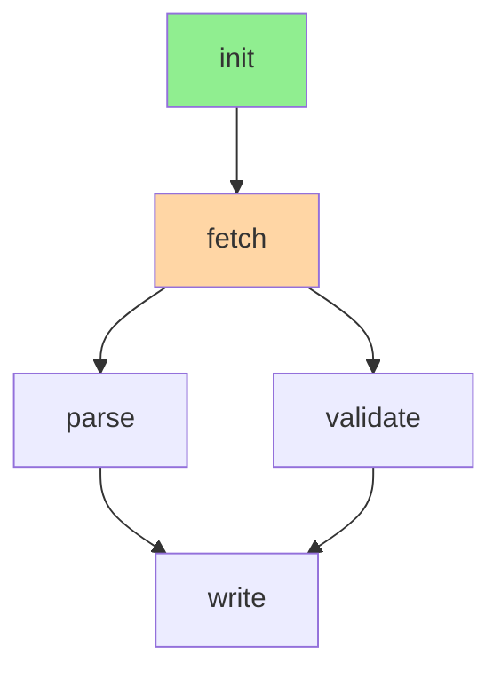

# Workflow Visualization

A *workflow* in mini_cc is an ordered tree of steps the agent can
execute autonomously: linear steps, parallel fan-out, conditional
skip/abort. The web UI surfaces a per-workflow drawer with three tabs.

## The drawer

Click any workflow name in the Run Table panel (right side of the chat
screen). A drawer slides in from the right with three tabs:

| Tab       | What it shows                                                  |
| --------- | -------------------------------------------------------------- |
| Mermaid   | Auto-generated flowchart. Done=green, active=amber, pending=grey. `parallel_with` groups render as fan-out branches. |
| JSON      | The raw workflow document (steps, state, status).              |
| YAML      | Same content as a compact YAML dump (no `js-yaml` dep — we ship a 50-line emitter). |

## Backend

- Tool: `workflow_create`, `workflow_add_step`, `workflow_run_step`,
  `workflow_run_all`, `workflow_status`, `workflow_set_state`.
- Persistence: workflows are saved under
  `<state>/<project>/workflows/<wf_id>.json` with a strict whitelist on
  `wf_id` (path-escape-safe).
- HTTP routes (read-only, session-scoped):
  `GET /sessions/{sid}/run-table/workflows` — active workflows + their
  current step status.
- Slash commands:
  - `/workflow`           — show active workflow status
  - `/workflow clear`     — drop the active workflow

## Mermaid rendering

The frontend calls a small helper that walks the step list and emits
graphviz-free mermaid `graph TD` source. Parallel groups use subgraphs:



Done steps render green; in-flight steps render amber; the rest are
left default (grey).

## Custom YAML emitter

We didn't pull `js-yaml` into the frontend bundle. Instead a tiny
emitter handles the subset we need (nested maps + string/array scalars
+ status enums). Keeps the workflow drawer contribution at ~zero
bundle-size cost.

## Smoke tests

`mini_cc/web/smoke/workflow_render.smoke.ts` — runnable via:

```bash
node --experimental-strip-types mini_cc/web/smoke/workflow_render.smoke.ts
```

Verifies that the Mermaid output is well-formed and that the YAML
emitter round-trips simple workflow documents.
