# mini_cc 架构总览（ARCH.zh.md）

> 本文用 Mermaid 图 + 中文解释，把 mini_cc 的**每个模块**以及**模块之间的连接**
> 讲清楚。重点拆解那些「叠加了多个实现」的层：`sandbox/`（沙箱）和 `tools/`
> （工具）——它们各自有一个 Protocol（接口）+ 多个可替换实现，是理解整个框架
> 扩展性的关键。
>
> 阅读顺序建议：先看 §0（一张图看全貌）→ §1（启动与请求主链路）→ §3/§4
> （沙箱与工具的「多实现」细节）→ §5+（其余子系统）。

---

## 0. 全局鸟瞰

mini_cc 是一个**多租户、可后端集成**的 Agent 框架，从教学用的单文件 `s20` 演化
而来。它同时支持「SDK 直接调用」和「HTTP/SSE 服务」两种用法，核心是一个会循环
调用 LLM 并执行工具的 `AgentLoop`。

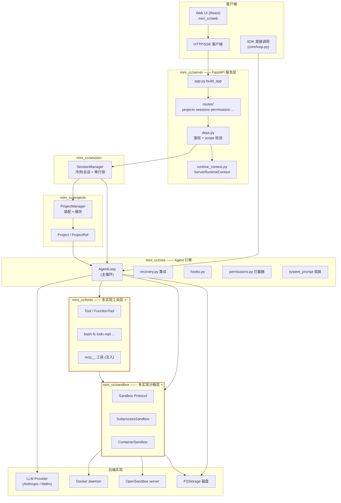

⭐ 标记的两层（`sandbox`、`tools`）是「一个接口 + 多个实现」的可替换层，也是本文
重点。其余子系统（`auth`/`mcp`/`scheduler`/`teams`/`workflow`/`lsp`/`skills`/
`plugins`/`commands`）见 §5。

---

## 1. 启动链路：从命令行到能服务请求

入口是 `python -m mini_cc.server`，走 `server/cli.py`。

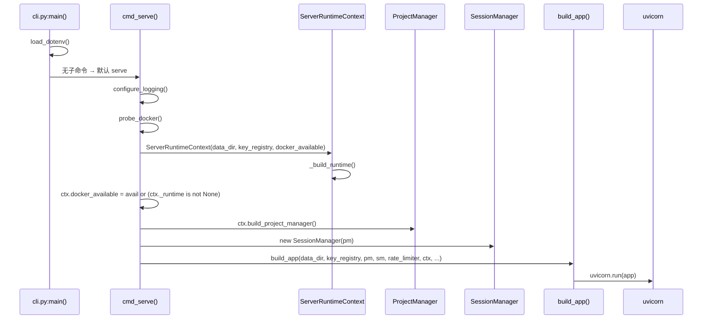

**关键点解释：**

- **`.env` 自动加载**（`cli.py:main`）：在任何子命令读 `os.environ` 之前就 `load_dotenv()`，
  这样 `OPEN_SANDBOX_*`、`MINI_CC_SANDBOX_BACKEND` 等变量不会因为忘记 `export` 而失效。
- **`probe_docker()`**（`sandbox/osdetect.py`）：探测本机 docker，Windows 上还会先试
  WSL2（`wsl docker version`，冷启动给 30s）。结果带一个 `argv_prefix`（例如
  `("wsl",)`），后面 `DockerRuntime` 拿它拼出 `["wsl","docker",...]`。
- **`ServerRuntimeContext`**（`server/runtime_context.py`）：服务端的「运行时上下文」，
  拥有：(1) 选定的容器后端 `_runtime`（三级选择，见 §3.3）；(2) per-tenant 的
  `TenantContainerManager` 缓存 `_container_mgrs`；(3) `_sandbox_factory` 闭包（决定
  某个租户的项目用哪种沙箱）。它还负责 shutdown 时停掉所有托管容器。
- **`docker_available` 的语义被改写过**：OpenSandbox 后端下 `probe_docker()` 返回
  unavailable，但只要 `ctx._runtime is not None`（即选到了 OS 后端），就视作「容器
  后端可用」，让自动降级逻辑判断正确。

---

## 2. 一次请求的完整生命周期（HTTP → AgentLoop → 工具 → 沙箱）

这是最重要的主链路。以「Web UI 发一句话、Agent 跑工具」为例：

```mermaid
sequenceDiagram
    participant C as 客户端
    participant R as routes/sessions.py
    participant D as deps.py
    participant SM as SessionManager
    participant PM as ProjectManager
    participant LOOP as AgentLoop.run()
    participant T as Tool (如 bash)
    participant SB as Sandbox
    participant LLM as LLM Provider

    C->>R: POST /projects/{tid}/{pid}/sessions/{sid}/messages
    R->>D: require_scope("sessions:write")
    D->>D: 解析 Bearer key → 校验 expiry → 校验 tenant → 校验 scope
    D-->>R: tid（已鉴权）
    R->>PM: get(pid, tenant_id=tid)  # 命中缓存则 ~1μs
    R->>SM: send(project_id, session_id, user_input)
    SM->>SM: _ensure_warm()  # 冷会话则重建 AgentLoop + 历史
    SM->>SM: acquire per-project lock（同项目串行）
    loop 每个 LLM 轮次
        SM->>LOOP: loop.run(user_input)
        LOOP->>LOOP: 注入 cron 已触发 / 后台任务通知 / todo 提醒
        LOOP->>LOOP: prepare_context() + assemble_system_prompt()
        LOOP->>LLM: provider.stream(system, messages, tools)
        LLM-->>LOOP: text_delta / tool_use / message_stop 事件流
        alt 有 tool_use
            LOOP->>LOOP: _make_ctx() → 构造 ToolContext
            LOOP->>T: tool.handle(ctx, args)
            T->>SB: ctx.sandbox.execute(...) / read() / write() ...
            SB-->>T: 结果
            T-->>LOOP: 字符串输出（tool_result）
            LOOP->>LOOP: 把结果 append 进 messages，进入下一轮
        end
    end
    LOOP-->>SM: 事件流（SSE）
    SM-->>R: yield 事件
    R-->>C: text/event-stream
```

**关键点解释：**

- **鉴权前置**（`deps.py:require_scope`）：每个路由用 `Depends(require_scope("xxx"))`，
  在进入业务逻辑前完成「key 有效 → 没过期 → tenant 匹配 → 持有所需 scope」四项校验，
  失败分别返回 401/403（带 `insufficient_scope` 细节）。Scope 形如
  `sessions:write`、`projects:read`，`*` 表示全权限。
- **`ProjectManager.get()` 带缓存**（`projects/manager.py:207`）：key 是
  `(tenant_id, project_id)`，并按 `.mcp.json`/`mcp.toml`/`permissions.toml` 的
  mtime 签名失效。暖路径约 1μs；首次冷装配会连接 MCP、建调度器等（见 §2.1）。
  **同一个项目的路由和热会话循环共享同一个 `Project` 对象**——这点很重要，否则状态
  会分裂。
- **会话串行**（`session/manager.py:send`）：`with self._lock_for(project_id)` 保证
  同一个项目同时只有一个 turn 在跑（LLM 调用是有状态的），不同项目则并行。
- **`AgentLoop.run()` 是「一轮完整对话」**（`core/loop.py:312`）：内部 `while` 循环
  反复「组装上下文 → 调 LLM → 执行工具 → 把结果塞回 messages」，直到模型不再请求
  工具为止。每轮开头还会注入「cron 到点」「后台任务完成」「todo 提醒」三类事件，
  让 Agent 能感知到这些异步触发。

### 2.1 Project 装配（`_assemble`）

`ProjectManager._assemble()`（`projects/manager.py:260`）把一个项目所有依赖一次性
组装好：

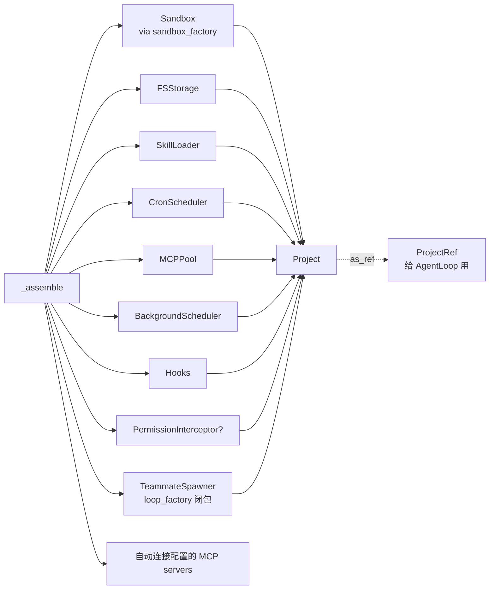

`ProjectRef`（`core/loop.py:132`）是 `Project` 的精简句柄，`AgentLoop` 只拿它需要的
字段（sandbox、storage、skills、scheduler、mcp、teams、permissions），解耦循环与
装配细节。

---

## 3. 沙箱层 `sandbox/` ——「多实现」核心之一 ⭐

沙箱是**所有文件操作和命令执行**的统一出口。它定义了一个 `Sandbox` Protocol，下面
挂着两类实现：本地子进程 / 容器。容器实现又把「后端」抽成另一个 Protocol
（`ContainerRuntime`），再挂 Docker / OpenSandbox / 测试替身三种实现。

### 3.1 两层接口与所有实现

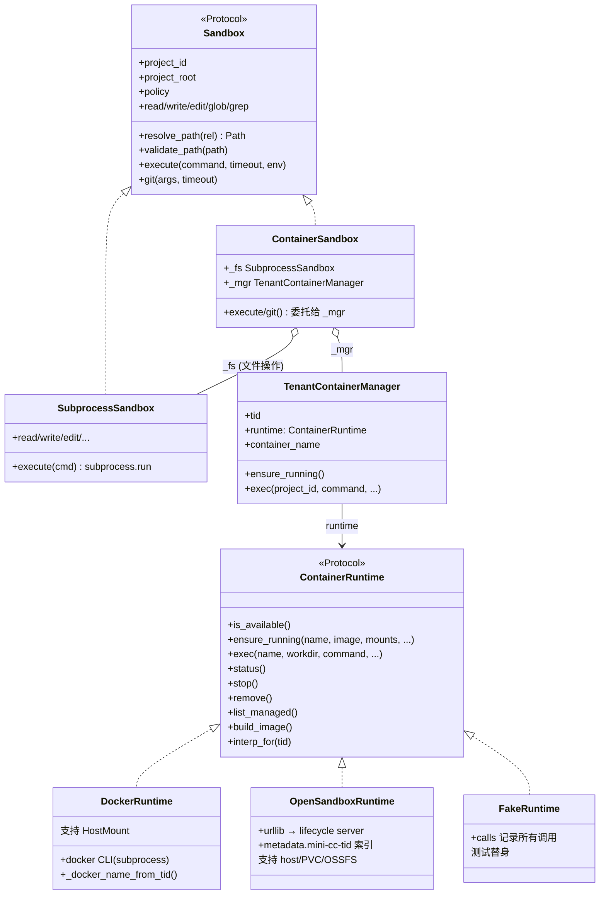

**为什么分两层接口？**

- `Sandbox`（对**工具**的承诺）：工具只关心「我能不能 read/write/execute」，不关心
  代码跑在本地还是容器里。`SubprocessSandbox` 和 `ContainerSandbox` 都实现它。
- `ContainerRuntime`（对**容器后端**的承诺）：`ContainerSandbox` 只管「把命令转给
  容器」，具体是 Docker 还是 OpenSandbox，由 `TenantContainerManager.runtime` 决定。
  这样**加一个新后端（如未来的 K8s/gVisor）只需再实现 `ContainerRuntime`**，上层
  全部不动。

**两个实现的分工：**

| 实现 | 文件操作 (read/write/edit/glob/grep) | 进程操作 (execute/git) |
|---|---|---|
| `SubprocessSandbox` | 宿主机，受 Policy 约束 | `subprocess.run`（POSIX sh） |
| `ContainerSandbox` | **仍走宿主机**（内嵌一个 `SubprocessSandbox` 做 `_fs`），因为工作区是 bind-mount 进容器的，宿主和容器看到同一份文件 | 转给 `TenantContainerManager.exec` → `runtime.exec` → `docker exec` / OS `/command` |

> 这是一个容易误解的点：**即使用了容器，文件读写还是在宿主机跑**，只有
> `execute()`/`git()` 才进容器。好处是文件操作快、且复用了宿主机的路径校验逻辑。

### 3.2 一次 `execute()` 的调用链（容器路径）

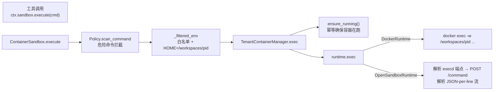

- **Policy 先拦**（`sandbox/policy.py`）：`scan_command` 用正则黑名单挡掉 `rm -rf /`、
  `sudo`、`mkfs`、fork bomb 等；`check_git_args` 只放行白名单内的 git 子命令；
  `filter_env` 按白名单过滤环境变量（避免把密钥带进容器）。
- **`ensure_running` 幂等**：每次 exec 前都调，但 `DockerRuntime` 会先 `status()`
  查一下，已在跑就直接返回（不会重复 `docker run`）。
- **`name=tid` 契约**（P6 Phase 2 重构）：`TenantContainerManager` 把**租户 id 原样**
  传给 `runtime.ensure_running/exec`。`DockerRuntime` 内部用
  `_docker_name_from_tid(tid)` 合成合法容器名 `mini_cc-<sanitized>`；`OpenSandboxRuntime`
  则用 `metadata.mini-cc-tid=<tid>` 做索引。**两种后端用同一个 tid 入参，各自决定怎么用它。**

### 3.3 三级后端选择与自动降级（`runtime_context.py`）

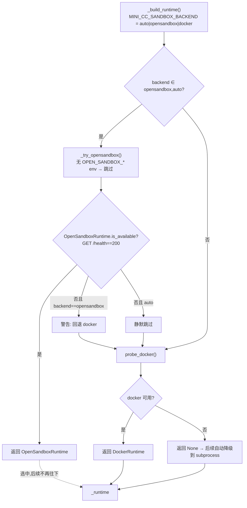

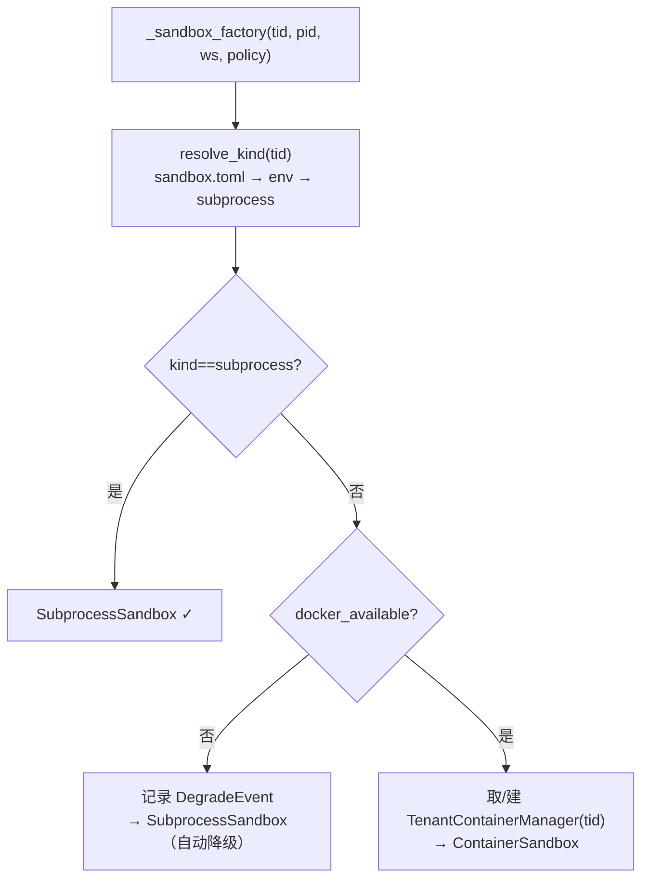

**两个降级点，意义不同：**

1. **`_build_runtime` 选不到后端**（docker 和 OS 都不可用）→ `_runtime=None`。
2. **`_sandbox_factory` 在装配某个项目时发现没有可用后端**（`docker_available=False`）
   → 即使租户 `sandbox.toml` 写了 `enabled=true`，也**静默回退**到
   `SubprocessSandbox`，并记一条 `DegradeEvent` 供监控。这是对用户需求「容器不可用时
   不要硬失败」的直接兑现。

### 3.4 挂载抽象 `MountSpec`（P6 Phase 2）

不同后端的挂载能力不同，`MountSpec` 把「挂什么」和「怎么挂」解耦：

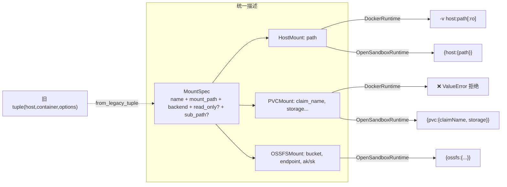

`from_legacy_tuple` 让老的 `(host, container, options)` 形态平滑迁移，所以 manager
层不必一次性全改。

---

## 4. 工具层 `tools/` ——「多实现」核心之二 ⭐

工具是 Agent 调用 LLM 之外能力的统一抽象。每个工具是一个 `(name, schema, handler)`
三元组，绑定一个 `ToolContext`（每次调用现场构造）。

### 4.1 接口、注册与注入

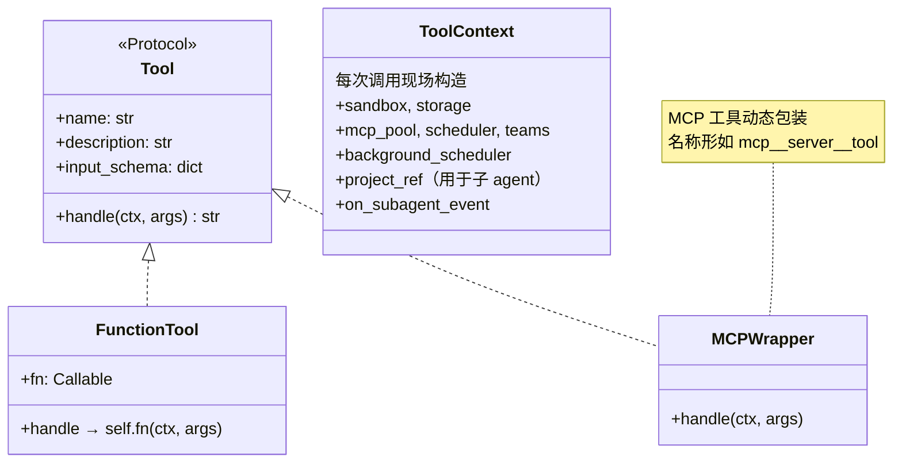

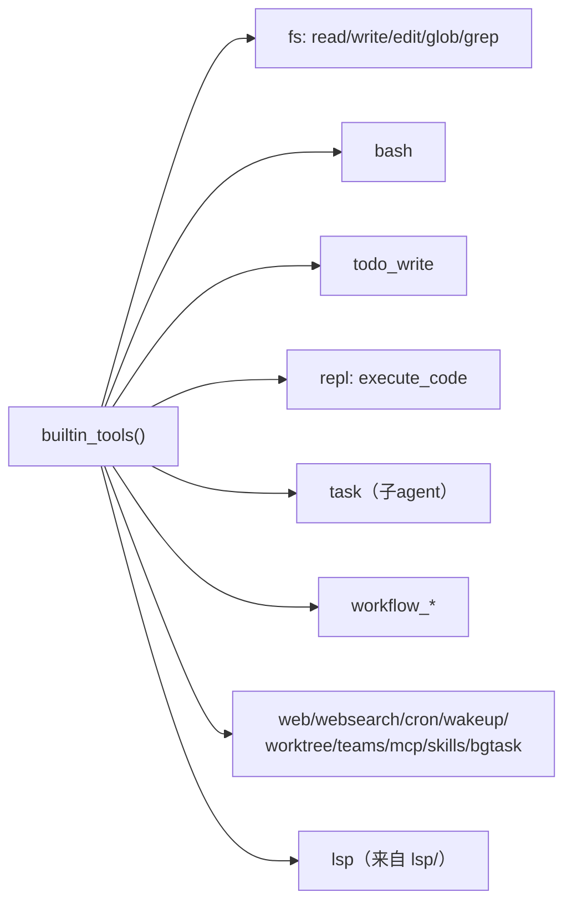

**工具聚合**（`tools/__init__.py:builtin_tools`）：把所有内置模块的 `ALL` 列表拼起来，
加上 `lsp` 的工具。然后 `AgentLoop._build_tools` 在内置基础上**追加 MCP 工具**：

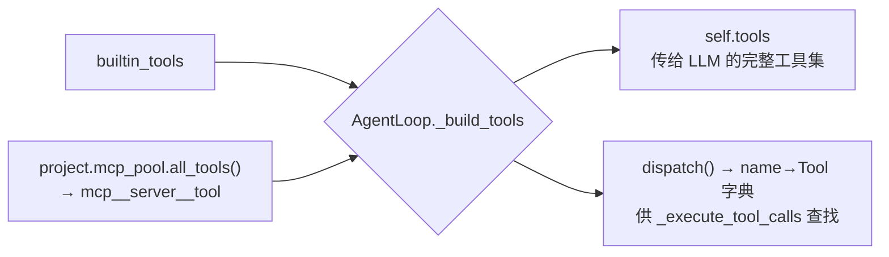

**工具如何被调用**（`core/loop.py:_execute_tool_calls`）：

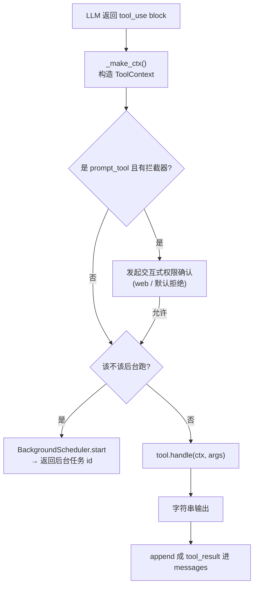

> `FunctionTool` 用闭包 `fn(ctx, args)`，使绝大多数工具都能用几行声明出来；少数有状态
> 的（MCP 包装、子 agent）则直接实现 `Tool`。

### 4.2 重点：`execute_code` 的多后端（REPL）

`tools/repl.py` 的 `execute_code` 工具是工具层里另一个「多实现」典型：同一段 python
代码，可以走**本地 pickle 持久化**，也可以走**远端 OpenSandbox Jupyter context**。

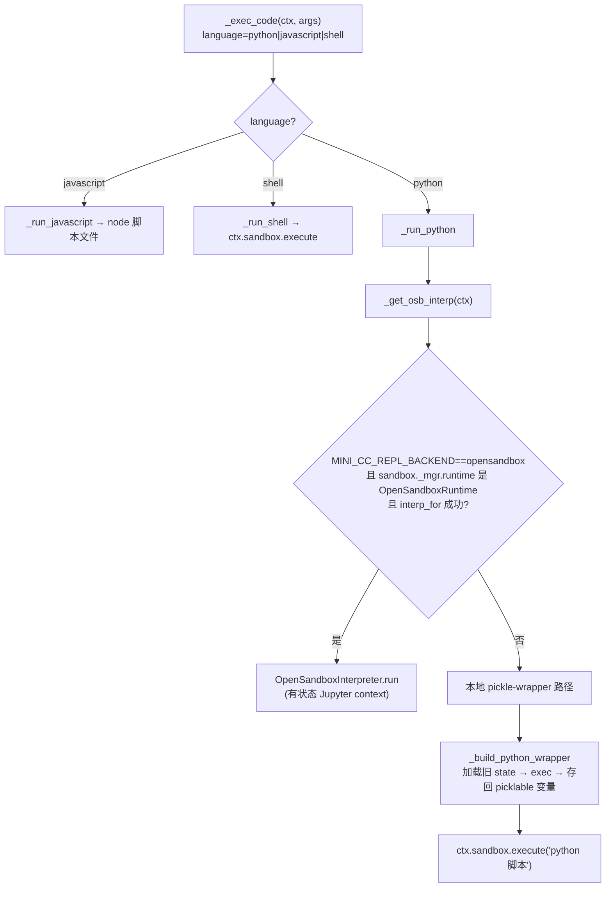

**两条路径对比：**

| 维度 | 本地 pickle-wrapper（默认） | OpenSandboxInterpreter（`MINI_CC_REPL_BACKEND=opensandbox`） |
|---|---|---|
| 状态持久化 | 把命名空间 pickle 到 `<ws>/.mini_cc/repl/<session>.python.pickle`，下次加载 | 远端 Jupyter kernel context_id 复用，变量常驻内存 |
| 执行位置 | `ctx.sandbox.execute`（本地或容器里的 python） | 远端 execd `/code` 端点（JSON-per-line 流） |
| 何时不可用 | python 不在 PATH | OS 后端未选 / sandbox 未启动 / 容器无 Jupyter |
| 失败处理 | 正常报错 | **静默回退**到本地路径（`_get_osb_interp` 返回 None） |

**`OpenSandboxInterpreter`**（`tools/opensandbox_interp.py`）：

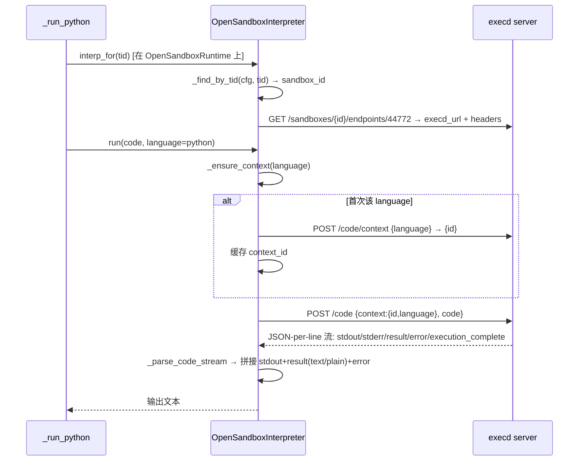

> 关键：context 是**按 language 懒建 + 复用**的，所以 `x=1` 之后再 `print(x)` 能拿到
> 1——这是「有状态」的核心。注意镜像必须含 Jupyter，否则 `/code/context` 会挂起
> （见 `docs/container-sandbox.md`）。

---

## 5. 其余子系统（按职责简述）

这些模块不构成「多实现层」，但都是主链路依赖的支撑系统。

### 5.1 鉴权 `auth/`

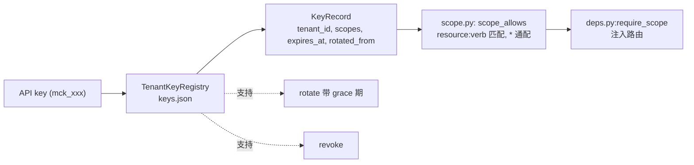

### 5.2 会话 `session/`

- **冷/热会话**：`SessionManager._sessions` 内存里持有 warm 的 `AgentLoop`；冷会话从
  磁盘（messages + todos）重建历史再 warm。
- **串行锁**：`_lock_for(project_id)`，同项目串行、跨项目并行；`try_lock` 供 HTTP
  返回 409 而非阻塞 worker。

### 5.3 存储 `storage/`

`FSStorage` 在 `<state_root>/<tenant>/.../<project_id>/` 下持久化
messages / todos / tasks / sessions / cron / workflows / transcripts / memory。
是 `Storage` Protocol 的默认实现，可换。

### 5.4 MCP `mcp/`

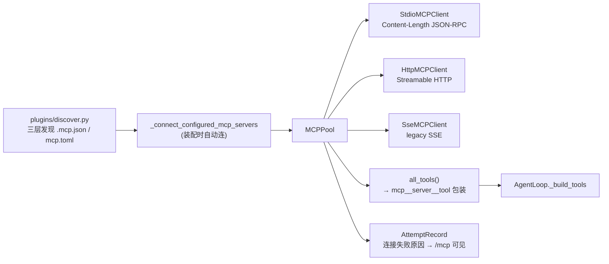

支持 Claude Code 的 `{"mcpServers":{...}}` 格式与老的 `mcp.toml`，JSON 在同层优先。

### 5.5 插件三层 `plugins/` + `skills/`

system → tenant → project 三层 `.mini_cc/` 目录，发现 skills（`SKILL.md`）和 MCP
servers，**project 层同名覆盖上层**。`ProjectManager.create` 会自动建好 tenant/project
的 `.mini_cc/skills/` 骨架；服务端启动时 bootstrap system 层。

### 5.6 调度 `scheduler/`、后台 `tools/background.py`

- `CronScheduler`：per-project cron 任务（`schedule_cron` 工具）；每轮 AgentLoop 开头
  `_inject_cron_fired` 把到点的任务作为「用户输入」注入。
- `BackgroundScheduler`：让某个工具调用以**后台线程**跑（`run_in_background`），
  `task_output`/`task_stop` 工具读取/取消；完成通知经 `_inject_background_notifications`
  进入下一轮。

### 5.7 多 Agent 协作 `teams/` + `workflow/` + 子 agent

- `tools/subagent.py` 的 `task` 工具：用 `ctx.project_ref` + `subagent_client_factory`
  派生一个**受限工具集**的子 AgentLoop，事件经 `on_subagent_event` 回流父循环 SSE。
- `teams/`：多 Agent 消息总线 + 计划审批门（`submit_plan`/`request_plan`）。
- `workflow/`：声明式多步工作流，支持并行（`parallel_with`）、条件、状态；Run Table
  在 Web 端可视化（Mermaid 流程图 + JSON + YAML）。

### 5.8 命令 `commands/` 与 `lsp/`

- `commands/registry.py`：斜杠命令（`/agents`、`/workflow`、`/bg`、`/mcp`、`/tools`、
  `/search`、`/export`、`/fork` 等）。
- `lsp/`：per-project 语言服务器池，提供 definition/references/hover/symbol 等 9 个
  操作，以 `LSP_TOOL` 形式加入工具集。

### 5.9 公开分享 `sharing/` 与 项目模板 `templates/`（F6/F7）

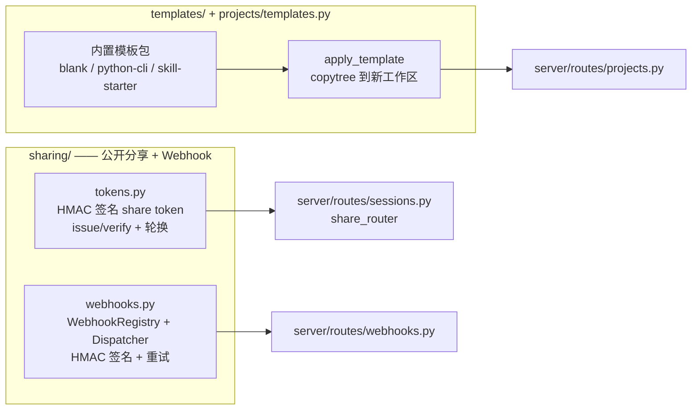

- **F7.1 share token**：`sharing/tokens.py` 用 HMAC-SHA256 签一个自包含 payload
  （`{project_id, session_id, mode, iat, exp, nonce}`）。密钥走 `MINI_CC_SHARE_SECRET`
  环境变量，逗号分隔的 `*_SECRETS` 支持优雅轮换。`sharing/tokens.py:verify_share_token`
  遍历候选密钥做 constant-time 比较。
- **F7.2 webhook**：`sharing/webhooks.py` 的 `WebhookRegistry` 把订阅持久化到
  `<state_root>/<pid>/webhooks.json`；`WebhookDispatcher` 包装 `AgentLoop.on_event`，
  匹配 `event_types` 后在独立 daemon 线程里 POST + HMAC 签名 + 指数退避重试 3 次。
- **F7.3 embed**：`server/routes/sessions.py:shared_embed` 渲染内联 HTML（含 CSP
  + X-Frame-Options: ALLOWALL），客户端 JS 拉 `/shared/{token}/messages`。
- **F6.1 模板**：`projects/templates.py` 提供 `list_templates / apply_template`，
  `templates/<name>/template.json` 描述元数据，其余文件作为种子拷进新工作区。
  `server/routes/projects.py:create_project` 在 `pm.create` 后调用并 `invalidate`
  缓存。操作员可通过 `MINI_CC_TEMPLATES_DIR` 放外部 pack。

---

## 6. 数据流与依赖方向小结

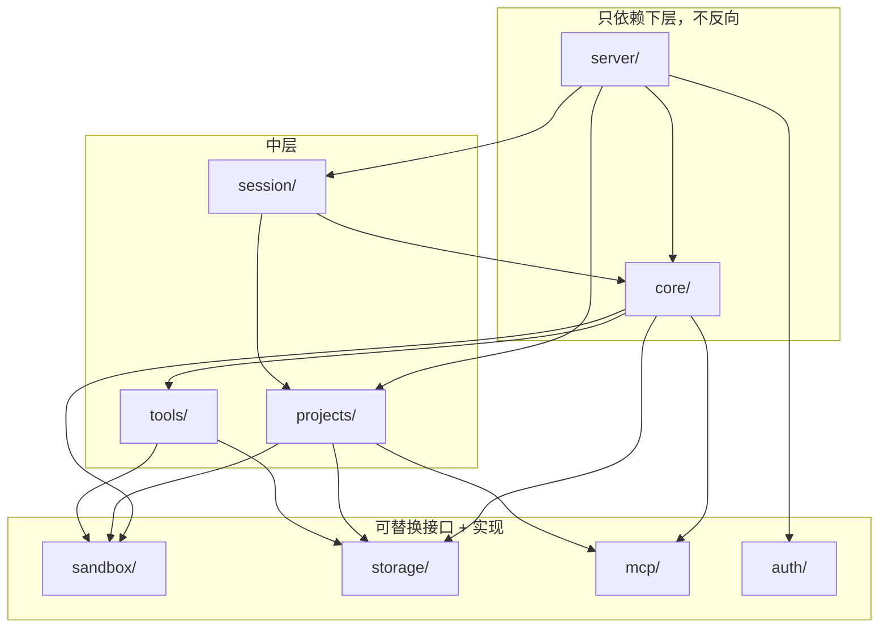

**一句话依赖律：上层（server/core）依赖中层（projects/session/tools），中层依赖基座
（sandbox/storage/mcp/auth）；基座不反向依赖上层。** 两个「多实现」接口——
`sandbox.Sandbox` / `sandbox.ContainerRuntime` 和 `tools.Tool`——是这套依赖能稳定
扩展的支点：换后端、换 LLM、换工具实现，都不需要改动调用方。

---

## 附：关键文件速查

| 关注点 | 文件 |
|---|---|
| 服务入口 | `server/cli.py:cmd_serve` |
| 路由 + 鉴权 | `server/routes/*.py`、`server/deps.py:require_scope` |
| 运行时上下文 / 后端选择 | `server/runtime_context.py:_build_runtime`、`_sandbox_factory` |
| 会话串行 | `session/manager.py:send`、`_lock_for` |
| 项目装配 | `projects/manager.py:_assemble`、`get`（缓存） |
| Agent 主循环 | `core/loop.py:AgentLoop.run`、`_execute_tool_calls`、`_make_ctx` |
| 沙箱接口与实现 | `sandbox/base.py`、`subprocess_sandbox.py`、`container.py` |
| 容器后端接口与实现 | `sandbox/runtime.py`、`opensandbox_runtime.py` |
| 容器生命周期 | `sandbox/manager.py:TenantContainerManager` |
| 安全策略 | `sandbox/policy.py:Policy` |
| 挂载抽象 | `sandbox/config.py:MountSpec` |
| 工具接口与注册 | `tools/base.py`、`tools/__init__.py:builtin_tools` |
| REPL 多后端 | `tools/repl.py:_run_python`、`_get_osb_interp`、`tools/opensandbox_interp.py` |
| MCP 工具注入 | `mcp/client.py:MCPPool.all_tools`、`core/loop.py:_build_tools` |
| 公开分享 token | `sharing/tokens.py:issue_share_token`、`verify_share_token` |
| Webhook 注册 + 派发 | `sharing/webhooks.py:WebhookRegistry`、`WebhookDispatcher` |
| 项目模板 | `projects/templates.py:list_templates`、`apply_template` |
| 斜杠命令 | `commands/registry.py:default_registry`、`_cmd_search`/`_cmd_export`/`_cmd_fork` |
| 跨会话检索 | `storage/fs.py:search_messages`、`storage/base.py:SearchHit` |
| 三层 memory | `memory/__init__.py:MemoryLoader`、`tools/memory.py` |
| 项目级系统提示 | `core/system_prompt.py:load_project_guide`、`assemble_system_prompt` |
